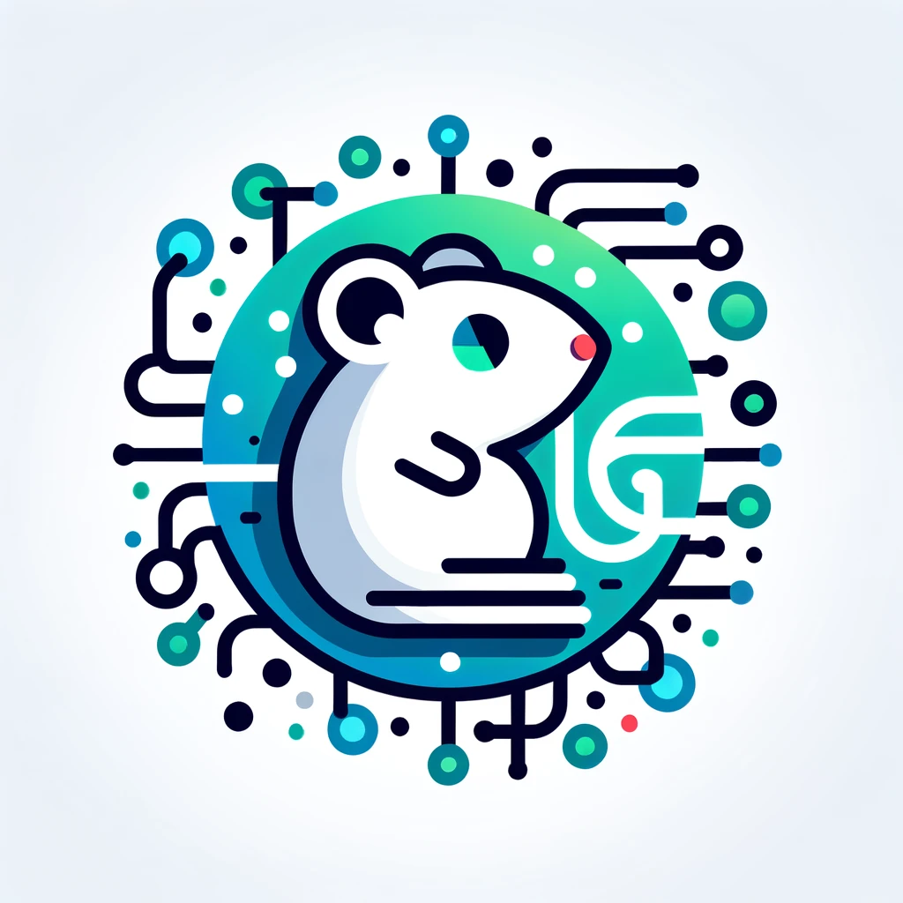

<!---->
<a href="https://golang.com"></a>
<a href="https://docker.com"></a>
<a href="https://whimsical.com/grates-project-HUPjJLnDj5TiGTHt15ZHzm"></a>
<a href="http://mgtu.tech/docs/index.html"></a>

# Grates server

RESTfull API собственного pet проекта - социальная сеть **Grates**

## 🛠️ Технологический стек

**Сервер:** Golang, [Gin framework](https://github.com/gin-gonic/gin), [Docker](https://www.docker.com/)


**DB:** PostgreSQL, Redis


## ❕ Требования к установке

На вашем компьютере обязательно должен быть установлен [Docker](https://www.docker.com/), запущен его демон и установлена утилита **make**. Golang версии 1.21 *(опционально)*.


## 💾 Установка

Склонируйте ропозиторий

```bash
  git clone git@github.com:passwordhash/grates.git
```

Перейдите в папку с проектом

```bash
  cd grates
```

Запустите сценарий через _make_

```bash
make dev
```

## 🚀 Запуск вручную

```bash
docker compose build db rdb migrate
docker compose up db rdb -d
sleep 2
docker compose up grate -d
go run ./cmd/http/main.go
```

## 📄 Документация

- **Swagger документация**  [/docs/index.html](https://mgtu.tech/docs/index.html)

- **Dashboard** проекта в [whimsical](https://whimsical.com/grates-project-HUPjJLnDj5TiGTHt15ZHzm)

## 🙋‍♂️ Автор

*студент МГТУ им Н.Э. Баумана ИУ7*

**Ярослав [@prostoYaroslav](http://t.me/prostoYaroslav)**

