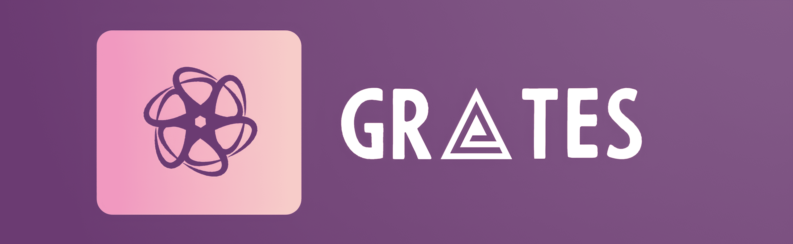

<!---->

<!---->
[](https://golang.com)
[](https://docker.com)
[](https://whimsical.com/grates-project-HUPjJLnDj5TiGTHt15ZHzm)

# Grates server

RESTfull API собственного pet проекта - социальная сеть **Grates**

## 🛠️ Технологический стек

**Сервер:** Golang, [Gin framework](https://github.com/gin-gonic/gin), [Docker](https://www.docker.com/)


**DB:** PostgreSQL, Redis


## ❕ Требования к установке

На вашем компьютере обязательно должен быть установлен [Docker](https://www.docker.com/) и запущен его демон. Golang версии 1.21 *(опционально)*.


## 💾 Установка

Склонируйте ропозиторий

```bash
  git clone git@github.com:passwordhash/grates.git
```

Перейдите в папку с проектом

```bash
  cd grates
```

Запустите скрипт [**run.sh**](#run-sh)

```bash
./run.sh 
```

## 🚀 <a name="run-sh"></a>run.sh
```bash
$ ./run.sh --help

    ./run.sh  [--no-build]

    --no-build   Если проект уже скомпилирован, можно запустить без
                 повторной компиляции.
```

Если при запуске скрипт выдал ошибку, попробуйте

```bash
 sudo ./run.sh
```

## 🚀 Запуск вручную

```bash
docker compose build 
docker compose up db rdb -d
sleep 2
docker compose up migrate -d
```

Если нужно перекомпилировать проект

```bash
go build -o main cmd/http/main.go
```

```bash
./main
```

## 📄 Документация

- **Swagger документация** по эндпоинту [/docs/index.html](http://localhost:8000/docs/index.html)

- **Dashboard** проекта в [whimsical](https://whimsical.com/grates-project-HUPjJLnDj5TiGTHt15ZHzm)

## 🙋‍♂️ Автор

*студент МГТУ им Н.Э. Баумана ИУ7*

**Ярослав [@prostoYaroslav](https://t.me/prostoYaroslav)**

